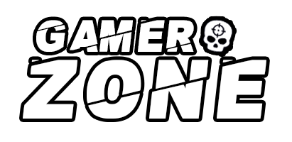

# GamerZone 🎮




> Projeto de uma interface web moderna e responsiva para uma plataforma de descoberta de jogos, permitindo aos usuários pesquisar, filtrar e ordenar um vasto catálogo de games.

**Acesse a aplicação em produção:** [**GamerZone App**](https://gamerzone-dimiendrix.vercel.app/ ) - *Substitua este link pelo seu deploy na Vercel.*

---

## 🚀 Sobre o Projeto

O GamerZone foi desenvolvido como um projeto de portfólio para demonstrar habilidades em desenvolvimento frontend utilizando tecnologias modernas e as melhores práticas do ecossistema React. A aplicação consome a API **RAWG Video Games Database** para buscar e exibir informações detalhadas sobre jogos.

O foco principal deste projeto é a **gestão de estado complexa** (filtros, ordenação e paginação) e a **construção de uma interface de usuário acessível e performática** com o uso de **TypeScript** para garantir a robustez do código.

### ✨ Funcionalidades Principais

*   **Listagem de Jogos:** Visualização de jogos em formato de cards.
*   **Busca Dinâmica:** Pesquisa de jogos por nome em tempo real.
*   **Filtro por Gênero:** Seleção de um ou mais gêneros para refinar a busca.
*   **Ordenação:** Opções de ordenação por relevância, data de lançamento, nome e mais.
*   **Design Responsivo:** Experiência de uso otimizada para diferentes tamanhos de tela.
*   **Modo Claro e Escuro (Dark Mode):** Alternância de tema para maior conforto visual.

---

## 🛠️ Tecnologias Utilizadas

Este projeto foi construído com um conjunto de ferramentas modernas e eficientes do ecossistema JavaScript/TypeScript:

### **Frameworks e Bibliotecas Principais**

*   **[React](https://react.dev/ )** — Biblioteca para construção da interface de usuário.
*   **[TypeScript](https://www.typescriptlang.org/ )** — Adiciona tipagem estática para maior segurança e escalabilidade.
*   **[Vite](https://vitejs.dev/ )** — Ferramenta de build rápida e moderna.
*   **[Chakra UI](https://chakra-ui.com/ )** — Biblioteca de componentes para UI acessível e estilização.
*   **[Zustand](https://zustand-demo.pmnd.rs/ )** — Gerenciador de estado simples e poderoso.
*   **[Axios](https://axios-http.com/ )** — Cliente HTTP para requisições à API.

### **Integrações e Funcionalidades**

*   **RAWG API** — Integração com a API de jogos para dados em tempo real.
*   **Custom Hooks** — Uso de hooks personalizados (`useGames`, `useGenres`) para encapsular a lógica de requisição e estado.
*   **Tratamento de Erros e Loading** — Implementação de estados de carregamento e erro para melhor UX.

---

## ⚙️ Scripts

| Comando | Descrição |
| :--- | :--- |
| `npm run dev` | Inicia o ambiente de desenvolvimento local. |
| `npm run build` | Gera a build de produção. |
| `npm start` | Inicia o servidor de produção (após o build). |

---

## 🧩 Configurações de Desenvolvimento

### **Pré-requisitos**

*   [Node.js](https://nodejs.org/en/ ) (versão 18.x ou superior)
*   [npm](https://www.npmjs.com/ ) ou [Yarn](https://yarnpkg.com/ )
*   Uma chave de API da [RAWG](https://rawg.io/apidocs )

### **Instalação**

1.  **Clone o repositório:**
    ```bash
    git clone https://github.com/dimiendrixmmiranda/gamerzone.git
    cd gamerzone
    ```

2.  **Instale as dependências:**
    ```bash
    npm install
    # ou
    yarn install
    ```

3.  **Configure as variáveis de ambiente:**
    *   Crie um arquivo chamado `.env` na raiz do projeto.
    *   Adicione sua chave da API RAWG a este arquivo. O Vite exige o prefixo `VITE_` para variáveis de ambiente acessíveis no frontend:

    ```
    VITE_API_KEY=SUA_CHAVE_DA_API_AQUI
    ```

4.  **Inicie o servidor de desenvolvimento:**
    ```bash
    npm run dev
    # ou
    yarn dev
    ```

5.  O projeto será iniciado em `http://localhost:5173` (ou a porta indicada no seu terminal ).

---

## 🧱 Estrutura do Projeto

A estrutura do projeto segue uma organização modular, focada na separação de responsabilidades:

/src
├── components/    # Componentes reutilizáveis de UI (Header, GameCard, etc.)
├── hooks/         # Lógica de estado e requisição customizada (useGames, useGenres)
├── services/      # Configuração do cliente Axios e API (api-client.ts)
├── store/         # Gerenciamento de estado global com Zustand
├── pages/         # Páginas principais da aplicação
└── theme/         # Configurações de tema do Chakra UI


---

## 🔥 Recursos Implementados

*   **Componentização Avançada:** Uso de componentes funcionais e hooks para criar uma UI modular e de fácil manutenção.
*   **Tipagem Estrita:** Definição de interfaces com TypeScript para todos os objetos de dados (Jogos, Gêneros, Plataformas).
*   **Gerenciamento de Estado com Zustand:** Utilização de um *store* global para gerenciar o estado dos filtros e da ordenação, desacoplando a lógica da UI.
*   **Design System (Chakra UI):** Uso de um sistema de design pronto para garantir acessibilidade e consistência visual.

---

## 📦 Dependências Principais

| Categoria | Pacote | Descrição |
| :--- | :--- | :--- |
| Framework | `react`, `react-dom` | Biblioteca principal e DOM. |
| Tipagem | `typescript` | Adiciona tipagem estática. |
| Estilo/UI | `@chakra-ui/react`, `@chakra-ui/icons` | Componentes de UI e ícones. |
| Requisições | `axios` | Cliente HTTP para API. |
| Utilitários | `react-icons` | Biblioteca de ícones. |

---

## ☁️ Deploy na Vercel

O projeto pode ser facilmente publicado na **Vercel**, aproveitando a integração nativa com **Vite/React**.

### **Passos para Deploy**

1.  Crie uma conta na [Vercel](https://vercel.com/ ) e conecte seu repositório Git.
2.  Configure a **branch principal** (ex: `main` ou `master`) para deploy automático.
3.  Configure a variável de ambiente **`VITE_API_KEY`** com sua chave da API RAWG.
4.  Clique em **Deploy**. A Vercel fará o build automático e disponibilizará a URL pública.

---

## 📜 Licença

Este projeto está sob a licença MIT.

---

## 💬 Contato

**Dimi Endrix M. Miranda**

*   GitHub: [@dimiendrixmmiranda](https://github.com/dimiendrixmmiranda )
*   LinkedIn: [Dimi Endrix](https://www.linkedin.com/in/dimi-endrix-m-miranda-038332203/ )
*   Email: [seu.email@exemplo.com](mailto:seu.email@exemplo.com)